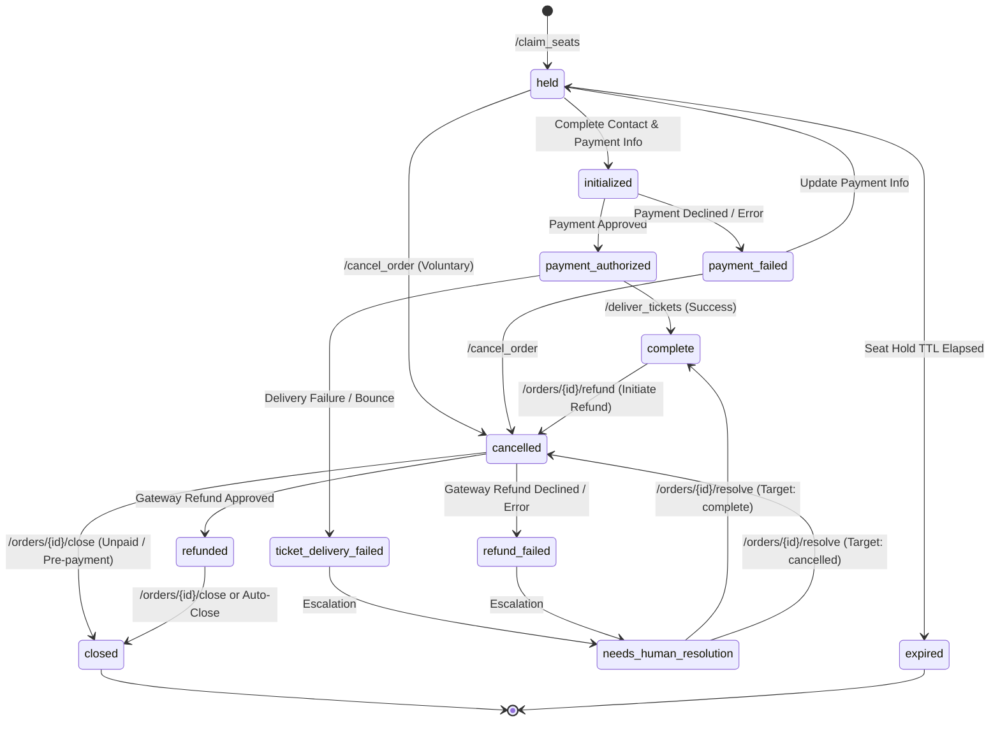

# Event Ticketing Service

A lightweight, concurrent Flask web service enforcing an order lifecycle state machine with SQLite (WAL mode), multi-threaded background fulfillment workers, optimistic seat hold TTL expiration, automated ticket generation & dispatch, and a deterministic payment gateway simulation test harness.

---

## Architecture Overview

- **Web Framework**: Flask (Python 3.11) organized with modular Flask Blueprints:
  - Seat Reservation Blueprint ([`seat_reservation_routes.py`](routes/seat_reservation_routes.py)): Manages seat holds, conflict checks, and hold TTL expiration.
  - Payment Blueprint ([`payment_routes.py`](routes/payment_routes.py)): Processes card authorizations and refunds through payment gateway abstractions.
  - Order Management Blueprint ([`order_routes.py`](routes/order_routes.py)): Customer details, checkout progression, administrative closures, resolutions, and queries.
  - Ticket Fulfillment Blueprint ([`ticket_routes.py`](routes/ticket_routes.py)): Auto-generates unique ticket codes per seat and handles multi-channel dispatch (Email/SMS) with delivery failure handling.
- **Database**: SQLite with Write-Ahead Logging (`WAL` mode) and foreign keys enabled:
  - Concurrent read/write support between incoming HTTP request threads and background worker daemon threads.
  - **UUIDv7 Primary Keys**: Generates timestamp-prefixed, sortable UUIDv7 IDs for orders.
  - **Audit History**: Append-only `order_status` table recording every state transition with timestamps.
  - **Ticket Inventory**: Dedicated `tickets` table storing unique seat tickets with status tracking (`issued`, `void`).
  - **Optimized Views & Indexes**: `v_orders_latest_status` view with composite indexes on `(processed_at, processing_started_at, created_at)`, `(hold_expires_at)`, and `(user_id)`.
- **Authoritative State Machine**: Centralized in [`state_machine.py`](state_machine.py). Acts as the single source of truth for all 12 order states, legal transitions, and domain invariants (guards).
- **Concurrent Background Worker**: Multi-threaded daemon pool in [`worker.py`](worker.py) (`Config.WORKER_THREAD_COUNT`, default: `2`). Uses atomic database row locking to prevent duplicate processing, automatically purges expired seat holds, cleans up abandoned carts, and fulfills active orders.
- **Payment Gateway Abstraction**: Interface in [`payment_gateway.py`](payment_gateway.py) paired with [`stub_payment_gateway.py`](stub_payment_gateway.py) simulating authorizations, declines, refunds, timeouts, and card-pattern outcomes.
- **Containerization**: Dockerfile and Docker Compose with persistent data volume mapping.

---

## State Machine

The order lifecycle is governed by an authoritative 12-state directed graph. Any transition not explicitly defined in `VALID_TRANSITIONS` or violating domain invariants is rejected with `HTTP 400 Bad Request`.

### State Diagram



### ASCII Transition Flow

```
                          +----------------------+
                          |         held         | (seats reserved with TTL)
                          +----+------------+----+
                               |            |
                   +-----------+            +----------------+
                   | (Provide Billing & Contact)             |
                   v                                         |
       +-----------------------+                             |
       |      initialized      |                             |
       +---+---------------+---+                             |
           |               |                                 |
     (Authorize)       (Cancel)                              |
           |               |                                 v
           | (Decline)     v                        +-----------------+
           |   +---> +---------------+              |     expired     | (terminal; cleaned up
           |   |     | payment_failed|              +-----------------+  by worker after retention)
           |   |     +-------+-------+                       ^
           |   |             | (Cancel: user lacks funds)    |
           v   |             v                               |
 +-------------------+ +---------------+                     |
 |payment_authorized | |   cancelled   | (unpaid terminal)   |
 +---+------------+--+ +---+---+---+---+                     |
     |            |        |   |   |                         |
 (Success) (Delivery Fail) |   |   +--(Close)----+           |
     |            |        |   |                 |           |
     |            v        |   |                 |           |
     |  +------------------------+               |           |
     |  | ticket_delivery_failed |               |           |
     |  +---------+--------------+               |           |
     |            |                              |           |
     |            v                              |           |
     |  +-----------------------+                |           |
     |  |needs_human_resolution |                |           |
     |  +-----+-----+-----------+                |           |
     |        |     |                            |           |
     | (Resolve) (Cancel)                        |           |
     |        |     |                            |           |
     v        v     +------------>--+            |           |
 +--------------+                   |            |           |
 |   complete   +-------------------+            |           |
 +--------------+ (Refund initiated)             |           |
        |                                        |           |
        v                                        |           |
 +---------------+                               |           |
 |   cancelled   |                               |           |
 +---+-------+---+                               |           |
     |       |                                   |           |
 (Success) (Fail)                                |           |
     |       |                                   |           |
     v       v                                   |           |
 +----------+ +-------------------+              |           |
 | refunded | |   refund_failed   |              |           |
 +----+-----+ +---------+---------+              |           |
      |                 |                        |           |
      |                 v                        |           |
      |       +-------------------------+        |           |
      |       | needs_human_resolution  |        |           |
      |       +-------------------------+        |           |
      v                                          v           |
 +--------------------------------------------------+        |
 |                      closed                      |        | (terminal)
 +--------------------------------------------------+        |
          +------- Holds expire after seat_hold_ttl ---------+
```

### Order States (12 States)

| State | Classification | Description |
|---|---|---|
| `held` | Initial | Seats temporarily claimed by a user or guest. Protected by a time-to-live (`SEAT_HOLD_TTL`). |
| `initialized` | In-Progress | All required contact information and payment details have been fully submitted. |
| `payment_authorized` | In-Progress | Payment gateway approved charge authorization; awaiting ticket generation and delivery. |
| `payment_failed` | Recoverable | Payment gateway declined charge or timed out. User can update payment details to retry. |
| `ticket_delivery_failed` | Escalation | Email bounced or dispatch failure occurred during delivery. Advances to `needs_human_resolution`. |
| `needs_human_resolution` | Escalation | Staff intervention needed due to delivery failure or gateway refund failure. |
| `complete` | Fulfillment | Tickets generated, dispatched, and marked delivered. Order is fully fulfilled. |
| `cancelled` | Intermediate / Pre-Terminal | Order cancelled before payment, or initiated for refund from `complete` / `needs_human_resolution`. |
| `refund_failed` | Escalation | Payment gateway rejected return of funds. Advances to `needs_human_resolution`. |
| `refunded` | Audit State | Gateway return of funds succeeded; records refund before advancing to `closed`. |
| `closed` | Terminal | Final terminal state for orders that were voluntarily cancelled or successfully refunded. |
| `expired` | Terminal | Seat hold TTL elapsed without payment; abandoned cart purged by worker after retention TTL. |

### Primary Order Lifecycle Flows

1. **Happy Path (Autonomous or Direct)**: `held` &rarr; `initialized` &rarr; `payment_authorized` &rarr; `complete`
2. **Payment Decline & Recovery**: `initialized` &rarr; `payment_failed` &rarr; `held` &rarr; `initialized` &rarr; `payment_authorized` &rarr; `complete`
3. **Pre-Payment Voluntary Cancellation**: `held` &rarr; `cancelled` &rarr; `closed` (immediately releases held seats for other buyers)
4. **Payment Decline Abandonment**: `initialized` &rarr; `payment_failed` &rarr; `cancelled` &rarr; `closed`
5. **Post-Fulfillment Refund**: `complete` &rarr; `cancelled` &rarr; `refunded` &rarr; `closed` (voids all issued tickets and returns funds)
6. **Failed Refund Escalation**: `complete` &rarr; `cancelled` &rarr; `refund_failed` &rarr; `needs_human_resolution`
7. **Ticket Delivery Failure & Re-delivery**: `payment_authorized` &rarr; `ticket_delivery_failed` &rarr; `needs_human_resolution` &rarr; `complete`
8. **Delivery Failure Cancellation / Refund**: `payment_authorized` &rarr; `ticket_delivery_failed` &rarr; `needs_human_resolution` &rarr; `cancelled` &rarr; `refunded` &rarr; `closed`
9. **Seat Hold Expiration & Database Cleanup**: `held` &rarr; `expired` &rarr; *permanently deleted after `EXPIRED_RETENTION_TTL`*

### Domain Invariants & Guard Enforcements

The state engine validates the following invariants before allowing any transition:
- **`_guard_held_not_expired`**: Rejects transitions from `held` if `hold_expires_at <= now` (unless transitioning to `expired`).
- **`_guard_order_complete_for_initialized`**: Requires all contact fields (`user_id`, `fname`, `lname`, `email`, `phone`, `addr_street`, `addr_city`, `addr_state`, `addr_zip`) and credit card fields (`cc_name`, `cc_number`, `cc_expiry`) before entering `initialized`.
- **`_guard_payment_authorized_has_transaction`**: Requires a valid `payment_transaction_id` before entering `payment_authorized`.
- **`_guard_refund_requires_payment`**: Prohibits transitioning to `refunded` or `refund_failed` unless an existing `payment_transaction_id` is present on the order.
- **Seat Conflict Guard**: Active seats cannot be double-booked across `held`, `initialized`, `payment_authorized`, `payment_failed`, `ticket_delivery_failed`, `complete`, or active `needs_human_resolution` (`HTTP 409 Conflict`).

---

## Configuration & Environment Variables

All settings are configured via environment variables in [`config.py`](config.py):

| Variable | Type | Default | Description |
|---|---|---|---|
| `DATABASE_PATH` | `str` | `data/ticketing.db` | Absolute or relative filesystem path to the SQLite database file. |
| `WORKER_POLL_INTERVAL_SECONDS` | `float` | `3.0` | Idle sleep duration (in seconds) between worker polling passes. |
| `WORKER_THREAD_COUNT` | `int` | `2` | Number of concurrent background worker daemon threads to spawn. |
| `WORKER_LOCK_TIMEOUT_MINUTES` | `float` | `5.0` | Maximum duration before an uncompleted worker record lock is considered stale and re-claimed. |
| `SEAT_HOLD_TTL` | `float` | `10.0` | Temporary seat hold validity duration (in minutes) before expiring. |
| `EXPIRED_RETENTION_TTL` | `float` | `5.0` | Retention duration (in minutes) before expired orders are purged from the database. |
| `TICKET_PRICE_CENTS` | `int` | `5000` | Default ticket price per seat in cents ($50.00). |
| `SIMULATE_WORK_DELAY_SECONDS` | `float` | `0.05` | Simulated external work delay (in seconds) for payment authorization, ticket rendering, and dispatch. |
| `HOST` | `str` | `0.0.0.0` | Host IP address to bind the Flask web application. |
| `PORT` | `int` | `5000` | Port number on which the web server listens. |
| `DEBUG` | `bool` | `true` | Enables Flask debug mode (reloader is disabled to prevent duplicate worker threads). |

---

## API Endpoints Reference

| Method | Endpoint | Request Body | Success | Error | Description |
|---|---|---|---|---|---|
| `POST` | `/claim_seats` | `{"user_id": str, "seats": list[str]}` | `201 Created` | `400`, `409` | Reserves a temporary seat hold (`held`) for `SEAT_HOLD_TTL` minutes. Checks active seat conflicts. |
| `PATCH` / `PUT` / `POST` | `/orders/<id>` | `{"contact_info": {...}, "payment_info": {...}, "user_id": str}` | `200 OK` | `400`, `404` | Updates customer details and billing information. Automatically transitions `held` &rarr; `initialized` once all details are complete. |
| `POST` | `/orders/<id>/process_payment` | *(empty)* | `200 OK` | `400`, `402`, `404` | Charges the order through the payment gateway (`initialized` &rarr; `payment_authorized` or `payment_failed`). |
| `POST` | `/orders/<id>/deliver_tickets` | `{"channel": "email"|"sms", "simulate_failure": bool}` | `200 OK` | `400`, `404`, `502` | Generates tickets (if missing) and delivers them to customer (`payment_authorized` &rarr; `complete` or `ticket_delivery_failed` &rarr; `needs_human_resolution`). |
| `GET` | `/orders/<id>/tickets` | *(none)* | `200 OK` | `404` | Retrieves all issued/voided tickets, seat numbers, and unique QR ticket codes for an order. |
| `POST` | `/orders/<id>/refund` | `{"amount_cents": int, "reason": str}` | `200 OK` | `400`, `402`, `404` | Refunds an authorized order (`complete` or `needs_human_resolution` &rarr; `cancelled` &rarr; `refunded` &rarr; `closed`, or `refund_failed` &rarr; `needs_human_resolution`). Voids tickets. |
| `POST` | `/orders/<id>/resolve` | `{"target_state": "complete"|"cancelled", "reason": str}` | `200 OK` | `400`, `404` | Resolves an escalated order in `needs_human_resolution` to either `complete` (re-delivering tickets) or `cancelled`. |
| `POST` | `/orders/<id>/close` | `{"reason": str}` | `200 OK` | `400`, `404` | Administratively closes an order in `cancelled` or `refunded` to terminal status `closed`. |
| `POST` | `/cancel_order` | `{"order_id": str, "reason": str}` | `200 OK` | `400`, `404` | Cancels an unpaid order (`held` or `payment_failed` &rarr; `cancelled`). Releases held seats immediately. |
| `GET` | `/orders` | *(none)* | `200 OK` | — | Lists all orders, their latest statuses, complete audit history log, contact info, billing info, and tickets. |
| `GET` | `/orders/<id>` | *(none)* | `200 OK` | `404` | Retrieves a single order record with full transition history, ticket items, and timestamps. |
| `GET` | `/health` | *(none)* | `200 OK` | — | Service health check returning `{"status": "healthy", "service": "EventTicketingService"}`. |

---

## Payment Gateway Test Harness Rules

The stubbed payment gateway ([`stub_payment_gateway.py`](stub_payment_gateway.py)) simulates deterministic payment processor outcomes using repeating last-4 card digit patterns:

| Card Ending | Authorization Outcome | Refund Outcome | Resulting State | Simulated Real-World Scenario |
|---|---|---|---|---|
| `...0000` | Declined (`HTTP 402`) | — | `payment_failed` | Insufficient funds on customer card |
| `...1111` | Declined (`HTTP 402`) | — | `payment_failed` | Card expired |
| `...2222` | Declined (`HTTP 402`) | — | `payment_failed` | Suspected fraud / high risk score |
| `...3333` | Declined (`HTTP 402`) | — | `payment_failed` | Invalid CVV / verification code |
| `...7777` | Approved (`HTTP 200`) | Error (`HTTP 402`) | Auth: `payment_authorized`<br>Refund: `needs_human_resolution` | Gateway network timeout during return of funds |
| `...8888` | Approved (`HTTP 200`) | Declined (`HTTP 402`) | Auth: `payment_authorized`<br>Refund: `needs_human_resolution` | Card issuer rejected return of funds (closed bank account) |
| `...9999` | Error (`HTTP 402`) | — | `payment_failed` | Payment gateway network timeout during authorization |
| Any other card (e.g. `...4242`) | Approved (`HTTP 200`) | Approved (`HTTP 200`) | Auth: `payment_authorized`<br>Refund: `closed` (via `cancelled` &rarr; `refunded`) | Normal valid charge and refund |

### Harness Control Modes

The stub harness can be controlled programmatically via `StubPaymentGateway.set_mode()`:
- `StubMode.AUTO`: Default mode evaluating card-number rules or enqueued responses.
- `StubMode.ALWAYS_AUTHORIZE`: Forces all authorizations to succeed.
- `StubMode.ALWAYS_DECLINE`: Forces all authorizations and refunds to decline.
- `StubMode.ALWAYS_ERROR`: Forces 5xx network error responses.

---

## Ticket Delivery Failure Simulation

The `/orders/<id>/deliver_tickets` endpoint can simulate email and SMS gateway dispatch failures, triggering escalation through `ticket_delivery_failed` &rarr; `needs_human_resolution`:

1. **Explicit Simulation Flag**: Pass `"simulate_failure": true`, `"fail_delivery": true`, or `"fail": true` in the request body.
2. **Bouncing / Invalid Email Addresses**: Any customer email containing `fail`, `bounce`, `undeliverable`, `@invalid`, `.invalid`, or missing both email and phone.
3. **Invalid Delivery Channel**: Any channel other than `"email"` or `"sms"`.

---

## Multi-Threaded Background Worker

The background worker daemon pool runs in [`worker.py`](worker.py):
- **Concurrency & Thread Safety**: Spawns `Config.WORKER_THREAD_COUNT` (default: 2) daemon threads (`OrderProcessorWorker-1`, `OrderProcessorWorker-2`).
- **Distributed Row Locking**: Implements race-free claim semantics directly in SQLite. Each worker atomically claims the oldest unprocessed record with:
  ```sql
  UPDATE orders
  SET processing_started_at = CURRENT_TIMESTAMP, locked_by = ?
  WHERE id = (
      SELECT id FROM v_orders_latest_status
      WHERE processed_at IS NULL
        AND (processing_started_at IS NULL OR processing_started_at <= timeout_cutoff)
        AND status IN ('initialized', 'payment_authorized', 'complete')
      ORDER BY created_at ASC
      LIMIT 1
  );
  ```
- **Stale Lock Recovery**: Automatically reclaims records if a worker crashed or exceeded `WORKER_LOCK_TIMEOUT_MINUTES` (default: 5.0 minutes).
- **Seat Hold TTL Expiration**: Sweeps orders in `held` where `hold_expires_at <= now` and transitions them to `expired`.
- **Expired Order Database Cleanup**: Permanently deletes `expired` orders and their status logs after `EXPIRED_RETENTION_TTL` (default: 5.0 minutes).
- **Autonomous Fulfillment Pipeline**:
  1. Claims oldest eligible record (`initialized` or `payment_authorized`).
  2. For `initialized` orders: Dispatches `POST /orders/<id>/process_payment`.
  3. For `payment_authorized` orders: Dispatches `POST /orders/<id>/deliver_tickets` (auto-creates tickets, renders codes, stamps `delivered_at`, and transitions to `complete`).
  4. Marks `processed_at = CURRENT_TIMESTAMP` and clears lock.
  5. Uses Flask's in-memory `test_client()` for zero-overhead internal dispatch, falling back to HTTP if run out-of-process.

---

## Quickstart

### 1. Run with Docker Compose (Recommended)

Start the service and background workers in Docker:
```bash
docker compose up --build -d
```
The service will be live at `http://localhost:5000`.

Check health:
```bash
curl http://localhost:5000/health
```

Stream live container and background worker logs:
```bash
docker compose logs -f
```

Stop the service:
```bash
docker compose down
```

---

### 2. Run Locally (Without Docker)

#### Prerequisites
- Python 3.11+
- Virtual environment tool (`venv`)

#### Setup and Start
```bash
# 1. Create and activate virtual environment
python -m venv .venv
source .venv/bin/activate  # On Windows: .venv\Scripts\activate

# 2. Install dependencies
pip install -r requirements.txt

# 3. Start the application
python app.py
```

The service will initialize the SQLite WAL database at `data/ticketing.db` and start the multi-threaded background workers.

---

## Sample API Workflow

### 1. Claim Seats (`held`)
```bash
curl -X POST http://localhost:5000/claim_seats \
  -H "Content-Type: application/json" \
  -d '{"user_id": "alice_smith", "seats": ["A1", "A2"]}'
```
Response (`HTTP 201`):
```json
{
  "message": "Seats held successfully for 10.0 minutes.",
  "order": {
    "id": "01a0e35e-35dc-7ace-ba5e-b6cad5c17270",
    "user_id": "alice_smith",
    "seats": ["A1", "A2"],
    "status": "held",
    "is_complete": false,
    "held_at": "2026-09-27 14:30:00",
    "hold_expires_at": "2026-09-27 14:40:00",
    "status_history": [
      {"status": "held", "created_at": "2026-09-27 14:30:00"}
    ]
  }
}
```

### 2. Provide Full Customer & Billing Details
Once all required contact fields and payment fields are supplied, the order automatically advances to `initialized`:
```bash
curl -X PATCH http://localhost:5000/orders/01a0e35e-35dc-7ace-ba5e-b6cad5c17270 \
  -H "Content-Type: application/json" \
  -d '{
    "contact_info": {
      "fname": "Alice",
      "lname": "Smith",
      "email": "alice@example.com",
      "phone": "555-0100",
      "addr_street": "123 Main Street",
      "addr_city": "Denver",
      "addr_state": "CO",
      "addr_zip": "80202"
    },
    "payment_info": {
      "cc_name": "Alice Smith",
      "cc_number": "4111111111114242",
      "cc_expiry": "12/28"
    }
  }'
```
Response (`HTTP 200`):
```json
{
  "message": "Order #01a0e35e-35dc-7ace-ba5e-b6cad5c17270 updated successfully.",
  "order": {
    "id": "01a0e35e-35dc-7ace-ba5e-b6cad5c17270",
    "status": "initialized",
    "is_complete": true
  }
}
```

### 3. Process Payment (`initialized` &rarr; `payment_authorized`)
*(Can be called manually, or picked up autonomously by the background worker)*
```bash
curl -X POST http://localhost:5000/orders/01a0e35e-35dc-7ace-ba5e-b6cad5c17270/process_payment
```
Response (`HTTP 200`):
```json
{
  "message": "Payment successfully authorized for Order #01a0e35e-35dc-7ace-ba5e-b6cad5c17270.",
  "payment": {
    "authorization_code": "AUTH_F12B9A",
    "status": "authorized",
    "success": true,
    "transaction_id": "txn_8c41f92e09b1"
  },
  "order": {
    "status": "payment_authorized"
  }
}
```

### 4. Deliver Tickets (`payment_authorized` &rarr; `complete`)
```bash
curl -X POST http://localhost:5000/orders/01a0e35e-35dc-7ace-ba5e-b6cad5c17270/deliver_tickets \
  -H "Content-Type: application/json" \
  -d '{"channel": "email"}'
```
Response (`HTTP 200`):
```json
{
  "message": "Tickets for Order #01a0e35e-35dc-7ace-ba5e-b6cad5c17270 successfully delivered via email.",
  "ticket_count": 2,
  "order": {
    "status": "complete",
    "delivered_at": "2026-09-27 14:32:05",
    "tickets": [
      {
        "id": 1,
        "seat": "A1",
        "ticket_code": "TKT-01a0e35e-35dc-7ace-ba5e-b6cad5c17270-A1-4F298B",
        "status": "issued"
      },
      {
        "id": 2,
        "seat": "A2",
        "ticket_code": "TKT-01a0e35e-35dc-7ace-ba5e-b6cad5c17270-A2-9E81C0",
        "status": "issued"
      }
    ]
  }
}
```

### 5. Inspect Tickets
```bash
curl http://localhost:5000/orders/01a0e35e-35dc-7ace-ba5e-b6cad5c17270/tickets
```

### 6. Process Full Refund (`complete` &rarr; `cancelled` &rarr; `refunded` &rarr; `closed`)
```bash
curl -X POST http://localhost:5000/orders/01a0e35e-35dc-7ace-ba5e-b6cad5c17270/refund \
  -H "Content-Type: application/json" \
  -d '{"reason": "Customer requested refund"}'
```
Response (`HTTP 200`):
```json
{
  "message": "Refund of $100.00 successfully processed for Order #01a0e35e-35dc-7ace-ba5e-b6cad5c17270. Order is now closed.",
  "refund": {
    "status": "authorized",
    "success": true,
    "transaction_id": "ref_a1e847c2109f"
  },
  "order": {
    "status": "closed",
    "status_history": [
      {"status": "held"},
      {"status": "initialized"},
      {"status": "payment_authorized"},
      {"status": "complete"},
      {"status": "cancelled"},
      {"status": "refunded"},
      {"status": "closed"}
    ]
  }
}
```

### 7. Enforcing Invariants (Rejection Example)
Directly attempting an illegal state transition (e.g., cancelling an already completed order without initiating a refund):
```bash
curl -X POST http://localhost:5000/cancel_order \
  -H "Content-Type: application/json" \
  -d '{"order_id": "01a0e35e-35dc-7ace-ba5e-b6cad5c17270"}'
```
Response (`HTTP 400 Bad Request`):
```json
{
  "error": "Invalid state transition: Cannot transition order from 'complete' to 'cancelled'."
}
```

---

## Integration Test Suites

The test suite in [`test_cases/`](test_cases/) contains **7 comprehensive test suites** covering all 12 states, domain guards, concurrency locking, and edge-case failure recoveries. Each test executes against an isolated, temporary SQLite database.

| # | Test Suite File | State Paths Exercised | Key Behaviors Verified |
|---|---|---|---|
| **1** | [`test_1_happy_path.py`](test_cases/test_1_happy_path.py) | `held` &rarr; `initialized` &rarr; `payment_authorized` &rarr; `complete` | Reserving seats, providing details, card authorization (`...4242`), ticket generation, delivery, and invariant checking. |
| **2** | [`test_2_payment_failure_recovery.py`](test_cases/test_2_payment_failure_recovery.py) | `held` &rarr; `initialized` &rarr; `payment_failed` &rarr; `held` &rarr; `initialized` &rarr; `payment_authorized` &rarr; `complete` | Card decline (`...0000`, 402 Insufficient Funds), card update with working card, reset to `held`/`initialized`, re-authorization, and completion. |
| **3** | [`test_3_voluntary_cancellation.py`](test_cases/test_3_voluntary_cancellation.py) | `held` &rarr; `cancelled` | Customer A reserves seats; Customer B is blocked with `409 Conflict`. Customer A voluntarily cancels; seats are released immediately for Customer B. |
| **4** | [`test_4_refund_cancellation.py`](test_cases/test_4_refund_cancellation.py) | `complete` &rarr; `cancelled` &rarr; `refunded` &rarr; `closed`<br>`complete` &rarr; `cancelled` &rarr; `refund_failed` &rarr; `needs_human_resolution`<br>`payment_failed` &rarr; `cancelled` | 4A: Successful refund flow.<br>4B: Issuer-declined refund (`...8888`) escalates to human resolution.<br>4C: Cancellation from payment decline.<br>4D: Invariants blocking refunds on uncompleted orders. |
| **5** | [`test_5_hold_expiration.py`](test_cases/test_5_hold_expiration.py) | `held` &rarr; `expired` | Hold TTL expiration enforcement. Guard rejects payment for expired holds; background worker automatically sweeps stale holds and frees inventory. |
| **6** | [`test_6_worker_processing.py`](test_cases/test_6_worker_processing.py) | 6A: `held` &rarr; `initialized` &rarr; `payment_authorized` &rarr; `complete`<br>6B: `held` &rarr; `initialized` &rarr; `payment_failed` | Multi-threaded worker orchestration: autonomous claim locking, endpoint dispatch, ticket generation, and error handling for declined cards. |
| **7** | [`test_7_ticket_delivery_failure_and_resolution.py`](test_cases/test_7_ticket_delivery_failure_and_resolution.py) | 7A: `...` &rarr; `ticket_delivery_failed` &rarr; `needs_human_resolution` &rarr; `complete`<br>7B: `...` &rarr; `needs_human_resolution` &rarr; `cancelled` &rarr; `closed`<br>7C: `...` &rarr; `needs_human_resolution` &rarr; `cancelled` &rarr; `refunded` &rarr; `closed`<br>7D: `held` &rarr; `cancelled` &rarr; `closed` | Delivery failure escalation (email bounce), manual resolution with re-delivery, cancellation to closed, refunding from resolution, and closing unpaid cancellations. |

### Running Tests in Docker

Run all 7 test suites inside the Docker container:
```bash
docker compose exec web python -m unittest test_cases/test_all_paths.py
```

Run individual test suites in Docker:
```bash
docker compose exec web python -m unittest test_cases/test_1_happy_path.py
docker compose exec web python -m unittest test_cases/test_2_payment_failure_recovery.py
docker compose exec web python -m unittest test_cases/test_3_voluntary_cancellation.py
docker compose exec web python -m unittest test_cases/test_4_refund_cancellation.py
docker compose exec web python -m unittest test_cases/test_5_hold_expiration.py
docker compose exec web python -m unittest test_cases/test_6_worker_processing.py
docker compose exec web python -m unittest test_cases/test_7_ticket_delivery_failure_and_resolution.py
```

### Running Tests Locally

Run all test suites locally:
```bash
python -m unittest test_cases/test_all_paths.py
```

Run individual test suites locally:
```bash
python -m unittest test_cases/test_6_worker_processing.py
```

---

## Repository Structure

```
EventTicketingService/
├── app.py                      # Flask application factory, server entry point, and logging setup
├── config.py                   # Centralized configuration and environment variable loading
├── database.py                 # SQLite WAL connection manager, schema initialization, and views
├── state_machine.py            # Authoritative 12-state state machine, transitions graph, and guard invariants
├── worker.py                   # Multi-threaded background fulfillment worker daemon pool & locking engine
├── payment_gateway.py          # Payment gateway interface abstraction, data classes, and singleton accessor
├── stub_payment_gateway.py     # Deterministic payment gateway test harness & card outcome simulator
├── Dockerfile                  # Container definition (Python 3.11-slim)
├── docker-compose.yml          # Container orchestration with volume-mounted SQLite storage
├── requirements.txt            # Python dependencies (Flask)
├── helpers/
│   ├── date_helpers.py         # UTC timestamp formatting utilities
│   └── uuid_helpers.py         # UUIDv7 generation for time-ordered database IDs
├── routes/
│   ├── __init__.py             # Master blueprint aggregator
│   ├── routes_common.py        # Shared payload serialization, field extractors, and seat parsers
│   ├── seat_reservation_routes.py # Seat claiming, hold TTL management, and conflict guards
│   ├── payment_routes.py       # Payment authorization and refund processing endpoints
│   ├── order_routes.py         # Customer updates, cancellations, resolutions, and queries
│   └── ticket_routes.py        # Ticket code generation, dispatch, and delivery failure simulation
└── test_cases/
    ├── README.md               # Detailed test walkthroughs and documentation
    ├── base_test.py            # Isolated SQLite test fixture & Flask test client harness
    ├── test_all_paths.py       # Master test runner executing all 7 suites
    ├── test_1_happy_path.py    # Path 1: Reserving, paying, delivering, invariant check
    ├── test_2_payment_failure_recovery.py # Path 2: Decline recovery and re-payment
    ├── test_3_voluntary_cancellation.py   # Path 3: Pre-payment cancellation and seat release
    ├── test_4_refund_cancellation.py      # Path 4: Refund execution, failures, and guards
    ├── test_5_hold_expiration.py          # Path 5: Seat hold TTL timeout & abandonment
    ├── test_6_worker_processing.py        # Path 6: Worker fulfillment & decline handling
    └── test_7_ticket_delivery_failure_and_resolution.py # Path 7: Delivery failure & human resolution
```

---

## What I'd change if I had time to iterate

1. **More Robust Worker Thread Failure Handling**:
   - **Thread Supervision & Auto-Restart**: Implement a supervisor/watchdog process to monitor worker daemon health and automatically respawn dead worker threads if an unhandled exception or runtime fault crashes a thread.
   - **Exponential Backoff with Jitter**: Replace fixed polling intervals with exponential backoff and jitter during transient database lock contention, network blips, or gateway outages.
   - **Dead-Letter / Quarantine Queue**: Track processing attempt counts per order. If an order repeatedly fails during background processing beyond a threshold (e.g. 3 attempts), transition it to a dedicated dead-letter state rather than continually retrying or holding stale locks until timeout.
   - **Distributed Task Queue Migration**: For horizontal scale across multiple server containers, graduate from local SQLite thread polling to a robust distributed message broker (such as Celery with Redis/RabbitMQ or AWS SQS).

2. **Better Logging and a Log Retrieval Endpoint**:
   - **Structured JSON Logging**: Switch from unstructured text logging to structured JSON logs with correlation IDs (`request_id`, `order_id`, `worker_id`, `thread_name`) for ingestion by log aggregators (e.g., Datadog, ELK stack, CloudWatch).
   - **Admin Log Retrieval Endpoint (`GET /admin/logs`)**: Provide a secure, paginated, and filterable endpoint (by `order_id`, `severity`, or `time_range`) allowing operators and customer support staff to view audit and fulfillment logs directly from the API without requiring container shell or SSH access.
   - **Enriched Audit Metadata**: Extend `order_status` with client IP, user-agent, and actor context (`system:worker`, `user:<id>`, `admin:<id>`) for forensic traceability.

3. **Authentication and Request Validation for Security**:
   - **API Authentication & Role-Based Access Control (RBAC)**: Secure endpoints with JWT or API Key authentication, separating public customer actions (`/claim_seats`, `/orders/<id>`) from privileged operator/admin actions (`/orders/<id>/resolve`, `/orders/<id>/close`, `/orders/<id>/refund`, and full order listing).
   - **Declarative Schema Validation (Pydantic / Marshmallow)**: Enforce strict schema validation on all incoming request payloads, returning standardized 422 Unprocessable Entity responses with granular field-level validation errors.
   - **Rate Limiting & Bot Protection**: Add token-bucket rate limiting (e.g., via Flask-Limiter with Redis) to `/claim_seats` to guard against seat scraping, inventory hoarding, and scalper bots.
   - **Payment Tokenization & PCI Compliance**: Replace direct raw credit card input with client-side tokenized payment methods (e.g., Stripe Elements or Adyen drop-in tokens), ensuring sensitive cardholder numbers never touch the application server.

4. **Increased / Maximum Processing Time Warnings and Error States for QoS Guarantees**:
   - **QoS Metrics & SLA Monitoring**: Instrument the order pipeline to emit latency metrics (Prometheus / StatsD) measuring time elapsed in each state (`held` &rarr; `initialized`, `initialized` &rarr; `payment_authorized`, `payment_authorized` &rarr; `complete`).
   - **Processing Time Warnings**: Log elevated warnings or emit alert webhooks when order fulfillment exceeds target Quality of Service (QoS) SLAs (e.g. payment authorization exceeding 2 seconds or ticket dispatch exceeding 5 seconds).
   - **Explicit Timeout & QoS Error State**: If an order remains locked or processing beyond an acceptable upper bound, automatically transition it to a `processing_timed_out` or `needs_human_resolution` state to notify on-call engineering while unlocking resources.

5. **Dedicated Domain Model (`Order` Class) for Validation, Serialization & Cleaner Code**:
   - **Rich Domain Entity / Pydantic Model**: Refactor database dictionary representations and tuple unpacking into an authoritative `Order` domain model.
   - **Encapsulated Business Logic**: Move transition rules, domain guards, missing field checks, and calculated properties (e.g. total amount calculation, formatted addresses, ticket counts) directly onto the `Order` class or value objects (`ContactInfo`, `PaymentInfo`, `SeatSelection`).
   - **Clean Serialization & Deserialization**: Standardize serialization between SQLite rows, domain models, and API responses, reducing boilerplate code in route handlers and eliminating field name inconsistencies.

